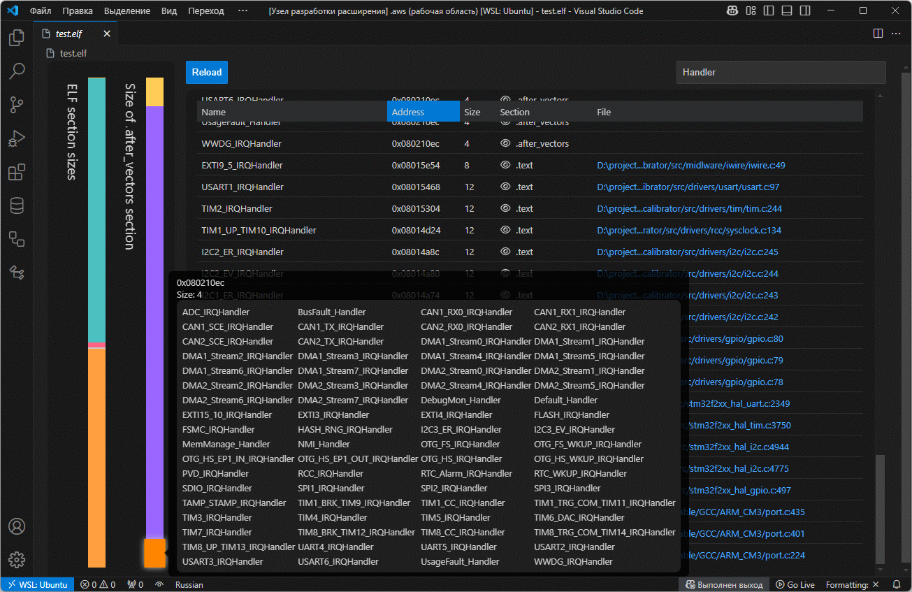

# ELF Analyzer

Extension for getting information about ELF files

Main functions:
* Getting information about Symbol Names
* Getting information about symbol sizes
* Filtering and sorting symbols
* Estimating the size of symbols and sections

